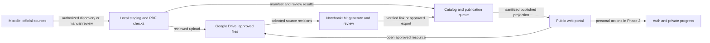

# Architecture, data model, and interfaces

Version 1.0 · 2026-09-26 · Proposed implementation design; no services provisioned.

## 1. Responsibilities

| Component                 | Owns                                                                                        | Does not own                                                   |
| ------------------------- | ------------------------------------------------------------------------------------------- | -------------------------------------------------------------- |
| Moodle                    | Official source materials, activity instructions, authoritative deadlines                   | Platform accounts and private study progress                   |
| Local library             | Download staging, original/converted checksums, conversion, human review, recoverable files | Public authentication or scheduled uptime guarantees           |
| Google Drive              | Published course PDF bytes and approved exported learning aids                              | Resource approval logic, the portal database, student progress |
| Portal catalog            | Stable IDs, localized metadata, source revisions, rights/access labels, publication history | Automatic access to otherwise restricted resources             |
| NotebookLM                | Supported source-based content generation and its own sharing controls                      | Portal-native quiz scores or portal authentication             |
| Auth and private database | Admin authorization and Phase 2 personal records                                            | Moodle credentials or student access to external services      |

All arrows involving files or third-party integrations require an authorized connection. This diagram does not imply API support for every step.

## 2. Proposed stack and deployment boundaries

GitHub is the confirmed source-code host. Version the application, migrations, tests, deployment templates, and planning documents there. Keep course PDFs in Drive and operational/student data in their designated storage. Repository ownership, name, visibility, and the CI/image-registry provider are still open; choosing GitHub for source code does not settle those details.

Use Astro and TypeScript for content pages and a modest interactive admin/dashboard interface. Deploy a Node application container and PostgreSQL on the ENSET-Skikda university server through Coolify, in an approved dedicated Linux VM under Proxmox or an existing suitably isolated application VM. Use Better Auth as the proposed authentication library for administrator Google sign-in first, student sign-in later. Better Auth documents Astro and PostgreSQL integrations. [Astro integration](https://better-auth.com/docs/integrations/astro), [PostgreSQL adapter](https://better-auth.com/docs/adapters/postgresql).

Use the existing domain's chosen subdomain with HTTPS. The app connects to PostgreSQL over a private container network; browsers communicate with the app, never directly with the database. Infrastructure details and open host decisions are in the [deployment specification](deployment-specification.md). Do not install the web application directly on the Proxmox hypervisor.

Astro's standalone Node adapter and Docker recipe support this packaging. Better Auth can keep sessions in the same database, avoiding a separate authentication service or Redis dependency initially. [Node adapter](https://docs.astro.build/en/guides/integrations-guide/node/), [Docker recipe](https://docs.astro.build/en/recipes/docker/), [session management](https://better-auth.com/docs/concepts/session-management). Use one web service and PostgreSQL; scheduled tasks may reuse the same application image without creating another API service.

Treat public rendering and private mutations differently:

- Public module and resource pages consume only a sanitized published projection. Start with cached server rendering and a generated catalog snapshot; do not send a service credential or private table to the browser.
- A publication job creates a versioned snapshot plus search index. Activate both together only after validation. Keep the previous successful projection for rollback.
- Purge or invalidate public projections when a file is withdrawn or permissions change. An emergency withdrawal must also revoke the external share where the operator controls it; removing a portal link alone does not revoke an already public file.
- Admin endpoints authenticate every mutation and verify the server-controlled role. Student endpoints enforce ownership in the shared server-side data access layer. Public cache keys never contain session-dependent output.
- Local conversion and upload jobs run as a separate Windows process. A local scheduled task can resume work while the PC is available; a scheduled server worker can check supported remote metadata but cannot assume access to `D:\My UFCs`.

Use a single scheduled worker instance for supported metadata discovery and queue housekeeping, with a database lease to prevent overlapping runs. Propose three checks per week as a configurable implementation of the confirmed “a few times per week” cadence; exact days and times remain to be chosen. The same process supports a manual “check now” action. A timer does not establish Moodle integration authorization.

Keep development, staging, and production configuration separate, including auth callbacks and databases. Use representative non-sensitive fixtures in staging and a separate test Drive folder. Store secrets in Coolify's protected configuration or Windows credential storage, not Markdown, Git, browser code, or public manifests. Pin supported dependency versions during implementation and prove runtime compatibility in M0. Do not expose Coolify, Proxmox, SSH, or database management ports to ordinary portal users.

## 3. Information architecture

| Route pattern                                       | Purpose                                                                    |
| --------------------------------------------------- | -------------------------------------------------------------------------- |
| `/{locale}/`                                      | Semester home, module list, recent changes                                 |
| `/{locale}/modules/{slug}`                        | Cover, overview, notes, resources, learning aids, official activities      |
| `/{locale}/resources/{id}`                        | Stable resource page with current approved revision and source links       |
| `/{locale}/search?q=...`                          | Search published metadata with module/type/language filters                |
| `/{locale}/updates`                               | Reviewed change feed, original publication date when known                 |
| `/{locale}/about`, `/privacy`, `/access-help` | Student initiative, data use, external account requirements                |
| `/admin`                                          | Review queue, source comparison, permissions, publish/withdraw, job health |
| `/{locale}/me` and `/me/settings`               | Phase 2 progress, bookmarks, privacy/export/deletion                       |
| `/{locale}/practice/{id}`                         | Phase 2 native reviewed practice activity                                  |

Locale values: `ar`, `fr`, `en`. Keep canonical IDs independent of translated titles. Do not automatically translate course content and present it as official. Missing translations use a labeled fallback. Apply direction to each content block, including Latin-script filenames inside an Arabic page.

## 4. Data model

**Terminology (2026-09-29):** the schema term for an immutable accepted copy of a resource is **revision** (`resource_revisions`, `resource_revision_id`). Where other planning documents say "version" or "source version" of a resource, they mean this revision. "Version" remains the term for practice-set, prompt-template, and application release versions.

Use UUIDs for platform entities, UTC timestamps for events, and explicit timezone/date precision for deadlines. These tables describe a logical model; implementation may consolidate optional entities while preserving the constraints.

| Entity                             | Essential fields and rules                                                                                                                                                                                                                                                                                                                       |
| ---------------------------------- | ------------------------------------------------------------------------------------------------------------------------------------------------------------------------------------------------------------------------------------------------------------------------------------------------------------------------------------------------ |
| `semesters`                      | `id`, canonical label, academic-year display label, `sort_order`; preserve existing year label until confirmed                                                                                                                                                                                                                               |
| `modules`                        | `id`, `semester_id`, stable slug, localized titles/overview, language, cover asset, Moodle course URL/ID, last successful discovery; cover rights status                                                                                                                                                                                     |
| `resources`                      | `id`, `module_id`, source provider + stable external ID, type, localized title/summary, display order, topics, origin (`official`, `student_note`, `ai_aid`), visibility, `current_revision_id`                                                                                                                                      |
| `resource_revisions`             | `id`, `resource_id`, revision number, original file SHA-256, converted SHA-256, original filename/MIME, final MIME, bytes/pages, Drive file ID/URL, local relative path (private), source modified time, discovered time, conversion tool/version, review status                                                                             |
| `rights_records`                 | Entity/revision reference, permission status (`unknown`, `link_only`, `approved_public`, `restricted`, `withdrawn`), allowed audience, rights evidence reference, reviewer and checked time; private evidence never included in public projection                                                                                      |
| `activities`                     | `id`, module, official URL/external ID, kind, reviewed instructions summary, audience, verification time and source revision; related typed date records retain opening, due, cut-off, quiz-close and availability dates with original text, UTC instant where known, IANA timezone and precision for each date; no student submissions/grades |
| `notebooks`                      | `id`, module/topic scope, owner reference, external URL/ID, access-tested time; private ownership/configuration fields                                                                                                                                                                                                                         |
| `learning_aids`                  | `id`, module, notebook reference, format, language, scope (`module`, `topic`, `source`), artifact URL or Drive file reference, generated/reviewed times, reviewer, publication/freshness state                                                                                                                                           |
| `aid_sources`                    | `aid_id`, immutable `resource_revision_id`, notebook source reference if available, observed source version at generation; unique pair                                                                                                                                                                                                       |
| `generation_jobs`                | `id`, requested format/language/scope, input fingerprint, priority, status, manual/automated method, lease/attempts, blocked reason, next eligible time, output reference                                                                                                                                                                      |
| `change_candidates`              | Provider/external ID, observed revision fingerprint, change type, detection method, detected time, review outcome; unique provider/ID/fingerprint tuple                                                                                                                                                                                          |
| `publication_events`             | Resource/entity and revision, action, safe public summary, actor, timestamp, correlation ID; append-only history                                                                                                                                                                                                                                 |
| `job_runs`                       | Job type, scheduled/started/completed times, counts, checkpoint, redacted error; success only after durable checkpoint                                                                                                                                                                                                                           |
| `profiles`                       | Stable auth-user ID, optional display name, UI language/timezone, creation time; no student registration number required                                                                                                                                                                                                                         |
| `user_roles`                     | User ID, role (`student`, `editor`, `owner`); writable only through trusted owner-controlled administration                                                                                                                                                                                                                                |
| `bookmarks`                      | User ID + resource ID unique pair, created time; Phase 2                                                                                                                                                                                                                                                                                         |
| `progress`                       | User ID + item ID, item/revision reference, state, self-reported completion time, updated time; Phase 2                                                                                                                                                                                                                                          |
| `practice_sets` / `questions`  | Module, publication version, prompt/options, language, reviewed explanation, source revision references; private answer key separated from pre-submission projection                                                                                                                                                                             |
| `attempts` / `attempt_answers` | Owner, immutable practice-set version, answer selection, server score, timestamps; Phase 2; no official grade claim                                                                                                                                                                                                                              |

Store requested generation-job source revision IDs in a join table too; a mutable notebook URL is insufficient input provenance. The job fingerprint combines sorted source revisions, scope, format, language, and prompt-template version. A repeat request with the same fingerprint reuses an existing queued/completed result unless explicitly requesting a new variant.

### Key invariants

1. A resource may have many revisions but only one current published revision. An upload is not publication.
2. Identical bytes across different modules may share a storage object but retain distinct pedagogical resource identities. A changed filename is not necessarily a new lesson.
3. A published aid references the precise revisions used. A new source revision flags affected aids; it never rewrites the lineage of an existing aid.
4. Access/rights approval applies to both sources and generated derivatives. Unknown permission blocks public file publication, but may allow an approved metadata-only official link.
5. User progress is attached to a stable item. A major revised item shows “review updated version”; existing completion is not silently erased or claimed against unseen material.
6. Publication transactions update current revision, history, and an outbox event atomically. Snapshot generation retries from the outbox, preventing a half-published catalog.
7. Missing data is explicit: unknown deadline differs from no deadline; failed discovery differs from no changes.

## 5. Roles and authentication

| Actor             | Allowed actions                                                                                                                                  |
| ----------------- | ------------------------------------------------------------------------------------------------------------------------------------------------ |
| Visitor           | Read published catalog and public aids, follow official links; cannot read drafts/private metadata                                               |
| Student, Phase 2  | Visitor rights plus own bookmarks, progress, practice attempts, data export and deletion                                                         |
| Editor            | Review, prepare, publish, correct and withdraw content/learning aids within assigned scope; no student study-history browsing or role management |
| Owner             | Editor rights plus role management, integration configuration and operational recovery                                                           |
| Ingestion process | Narrow service capability to submit candidates/manifests and job status; no automatic role grants or broad student-record access                 |

Use Google sign-in through the chosen auth library with identity scopes only. Maintain its documented user/account/session/verification tables separately from course tables, with migrations reviewed and pinned. The administrator's Drive connector is a separate authorization flow; student sign-in must not request Drive access. Google account ownership is not proof of UFC enrollment, and enrollment verification is not part of the confirmed public-browsing model.

Bootstrap the first owner through a trusted server-side configuration after verifying the provider identity. Never grant admin based on a client-supplied email or editable profile metadata. Validate sessions at the server boundary and require a user-scoped data-access function for every private record query. Use a non-superuser runtime database role and parameterized queries. Database row-level security may be added as defense in depth only with transaction-scoped identity and policy tests; do not assume session identity reaches PostgreSQL automatically through an auth library. Restrict migration credentials to deployment tasks.

Use secure, HTTP-only session cookies and exact trusted origins/callbacks; verify origin/CSRF handling for cookie-authenticated mutations. Session revocation, return-URL validation, role checks and account deletion must be tested against the chosen library version. Never write custom OAuth token validation when the supported library can perform it.

Configure a fixed HTTPS base URL and exact Google callback `https://<chosen-subdomain>/api/auth/callback/google`; `<chosen-subdomain>` is a placeholder, not a selected hostname. Use host-only cookies and trust only the portal origin, not every university subdomain. Keep Google credentials at runtime and leave CSRF/origin defenses enabled. [Google provider](https://better-auth.com/docs/authentication/google), [Better Auth security](https://better-auth.com/docs/reference/security). Use verified `session.user.id` as the owner for all private operations. Disable session cookie caching initially so revocation tests are straightforward; prove sessions survive container redeploys.

Account deletion needs explicit configuration and application-data cleanup. Review the library's deletion hooks and fresh-session behavior, then test removal of bookmarks, progress and attempts as well as the auth account. [User/account lifecycle](https://better-auth.com/docs/concepts/users-accounts).

Proposed personal-data defaults: no tracking cookies before sign-in, no advertising analytics, optional display name, no class roster import, and no administrator view of individual study behavior. Account deletion removes bookmarks/progress/attempts and revokes the app session; private backup expiry must be explained. Detailed retention targets appear in [operations](validation-and-operations.md). Any jurisdiction-specific privacy obligations must be checked before public launch; these design choices are not a legal compliance determination.

## 6. Interface contracts

These describe behavior, not an instruction to implement a second API layer if the chosen framework can provide the same boundaries cleanly.

| Operation                                   | Contract                                                                                                                         |
| ------------------------------------------- | -------------------------------------------------------------------------------------------------------------------------------- |
| `GET /api/catalog`                        | Published projection only; locale/filter/cursor validation, bounded page size, revision/ETag, no private paths                   |
| `POST /api/admin/candidates`              | Admin/ingestor only; validated manifest, idempotency key, source identity; returns existing candidate on replay                  |
| `POST /api/admin/resources/{id}/publish`  | Editor/owner; expected revision, completed review/rights checks, atomic event; stale review returns conflict                     |
| `POST /api/admin/resources/{id}/withdraw` | Editor/owner; reason required, invalidate all projections and dependent aids; external share action tracked separately           |
| `POST /api/admin/generation-jobs`         | Editor/owner; exact source revisions, format/language, deduplicated fingerprint; pending does not promise completion time        |
| `PUT /api/me/bookmarks/{resourceId}`      | Signed-in owner; idempotent set/remove; no arbitrary user ID accepted                                                            |
| `PUT /api/me/progress/{itemId}`           | Signed-in owner; allowed state, item revision, conflict-safe update                                                              |
| `POST /api/me/practice/{setId}/attempts`  | Valid reviewed version; server checks question ownership, selections and score; answer key released according to practice policy |
| `GET /api/me/export`, `DELETE /api/me`  | Recent authentication; export only caller's records; deletion confirmation and background cleanup status                         |

Use consistent errors: unauthenticated, forbidden, not found, invalid input, stale revision, rate limited, and dependency unavailable. External Drive/Moodle/NotebookLM failures should show useful access guidance without leaking raw provider errors or credentials. Reject arbitrary remote URL fetching in import endpoints; supported providers and hostnames must be explicitly allowed.

## 7. Search and resilience

Index only public title, module, topics, language, type, and reviewed summary in Phase 1. Preserve original Arabic while building a normalized search form; test hamza variants, diacritics, tatweel, and mixed Arabic/Latin queries. Do not perform unrestricted stemming that changes meaning. Full PDF extraction/OCR search is a later decision requiring rights, extraction-quality, and bandwidth review.

If PostgreSQL is unavailable but the application VM remains healthy, retain the last published public snapshot with its timestamp; disable private writes clearly. A full VM/host outage requires recovery or a separately planned static mirror, not an assumed automatic failover. If publication fails, keep the previous projection active and report failure to the administrator. Never serve cached private pages publicly. Restore database metadata and Drive files independently, then verify the catalog pointers before reopening writes.
