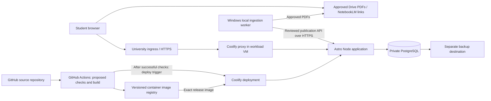

# Deployment specification — ENSET-Skikda infrastructure

Updated **26 September 2026**. This is a proposed deployment design, not an executed configuration. Official references were checked on this date. No university server, DNS, firewall, Google Cloud project, or Coolify instance was accessed or modified.

## 1. Confirmed direction and deployment boundary

The user selected the university's ENSET-Skikda server environment, Proxmox/Coolify, and a subdomain of an existing domain. Samir will maintain content a few times per week and confirms sharing permission for intended materials. Hosting there does not itself establish endorsement by either UFC or ENSET-Skikda.

Proposed topology: an institution-approved **dedicated Linux VM on Proxmox**, running Docker workloads managed through Coolify. Use the existing Coolify control plane if available and approved; otherwise install it inside an appropriate Linux VM. Do not install the application stack or Coolify directly on the Proxmox hypervisor. The proposed application is Astro/TypeScript with a Node server, PostgreSQL, and Better Auth; Google Drive remains PDF storage. No Supabase or Cloudflare runtime is required.

Before deployment, the infrastructure owner supplies the VM allocation, supported Linux image, network/VLAN, backup destination, DNS owner, exact hostname, ingress route, and operational access. These are configuration inputs, not reasons to delay writing or building the application locally. Proxmox documents Linux VM configuration, VirtIO devices, and guest-agent integration; use settings supported by the institution's installed version. [Proxmox: QEMU/KVM documentation source](https://github.com/proxmox/pve-docs/blob/master/qm.adoc)

## 2. Capacity and service layout

Coolify documents **2 CPU cores, 2 GB RAM, and 10 GB free disk** as its minimum, with additional resources needed for workloads and builds. This is not a production sizing guarantee for the combined portal. [Coolify: Self-hosted requirements](https://coolify.io/docs/start-with-self-hosted)

Proposed initial pilot estimate: **4 vCPU, 8 GB RAM, 80 GB SSD-backed disk**, subject to host capacity and load testing. Keep at least 20% disk headroom; build images in CI where possible. This estimate assumes a modest catalog and student traffic, PDFs served through Drive, no server-side video transcoding, and no local LLM inference. Measure CPU, memory, database connections, disk growth, and concurrent requests before increasing allocation. Existing infrastructure may make additional hosting expenditure small, but electricity, maintenance, backups, storage, domain management, and replacement capacity are not guaranteed free.

Deploy the web app as one Coolify **Docker Image** application and PostgreSQL as a separate managed database resource. Connect them only through a verified private Docker network; test the actual Coolify destination/network settings. Keep application sessions and job state in PostgreSQL, not process memory. The application must run without a privileged container, host networking, or a Docker socket mount. Select and pin supported runtime/database versions during implementation rather than using mutable `latest` tags.

## 3. DNS, HTTPS, and network controls

Choose one final production hostname, represented here as `https://<approved-subdomain>`. The DNS administrator creates the appropriate A/AAAA record or CNAME to the approved university ingress. Publish an AAAA record only if IPv6 routing and filtering work. Confirm whether the site is internet-accessible, behind NAT, or behind an existing university reverse proxy.

Coolify routes a configured HTTPS domain to the selected container; for a Node process listening on internal port 3000, its domain configuration can target that internal port without exposing public port 3000. Validate host, path, TLS, and forwarded-header behavior through the complete ingress chain. [Coolify: Domains](https://coolify.io/docs/core/networking/domains)

For the recommended Traefik proxy, the default ACME HTTP challenge needs public TCP 80 reachability. If the institution permits that route, use HTTP validation and automatic certificate renewal. If port 80 is unavailable, use DNS validation only after confirming a supported DNS provider and scoped credentials that can create/delete the required `_acme-challenge` TXT record. DNS validation also supports wildcard certificates, but this project does not need a wildcard. Where university ingress terminates TLS, document that certificate owner and renewal mechanism instead of creating competing issuers. [Coolify: DNS challenge](https://coolify.io/docs/core/networking/proxy/traefik/dns-challenge)

Proposed traffic policy:

| Path | Allowed traffic |
| --- | --- |
| Public ingress | HTTPS 443; HTTP 80 only for approved redirect/ACME setup |
| Administration | SSH and Coolify management through institution-approved VPN or restricted administrator addresses |
| Application → database | PostgreSQL on private network; no public port 5432 mapping |
| Server egress | HTTPS to authorized Moodle/Drive/Google APIs, identity endpoints, registry, update repositories, backup destination, and selected monitoring service |
| Infrastructure services | Institution-approved DNS and time synchronization; outbound mail only if later configured |

Coolify's direct self-hosted dashboard uses ports 8000/6001/6002; those need not remain publicly reachable after a domain route is working. Preserve administrative access while changing firewall rules. Test upstream and Docker-related filtering; a nominal host firewall setting is not acceptance evidence. [Coolify: Firewall](https://coolify.io/docs/core/infrastructure/servers/firewall)

## 4. Identity, configuration, and secrets

Keep Google student sign-in separate from administrator Drive authorization. Public browsing requires neither. Production authentication uses the approved HTTPS origin, secure host-scoped cookies, exact allowed origins, and server-side role checks. Do not require a university email domain unless the user later requests it.

With Better Auth's default route base, the production callback is:

`https://<approved-subdomain>/api/auth/callback/google`

Set the explicit application base URL and register that complete callback in Google Cloud. A changed auth base path requires a changed registered callback. Verify the real deployed callback in a pilot rather than copying a development URL. [Better Auth: Google provider](https://better-auth.com/docs/authentication/google)

Google requires exact redirect matching, including scheme, case, and trailing slash. Use separate development/staging and production credentials, or explicitly registered origins according to the chosen environment design. Test success, denied consent, logout, expired session, and account deletion on desktop and iPhone. [Google: Web-server OAuth](https://developers.google.com/identity/protocols/oauth2/web-server)

Runtime secrets include the database credential, auth secret, Google client secret, authorized admin integration tokens, registry credential, and backup credential. Keep them out of Git, container image layers, client JavaScript, public environment variables, and ordinary logs. Grant the application a non-superuser database role and a separate migration role. Record secret owners and rotation steps; production secrets never enter preview environments.

## 5. Build, deploy, and rollback

**GitHub is the confirmed source-code host.** Store application code, database migrations, tests, deployment templates, and project documentation in its repository. Record the owner/organization, repository name, visibility, and access roles before implementation setup; these have not yet been selected. Course PDFs stay in Drive, and secrets, database dumps, student records, and local intake files stay outside the repository.

**GitHub → Coolify is the confirmed CI/CD direction.** The proposed implementation uses GitHub Actions to run checks, build a container image, publish it, and trigger Coolify only after success. Coolify documents this integration and supports deployment of the resulting image without rebuilding it on the university server. [GitHub Actions with Coolify](https://coolify.io/docs/applications/sources/github/actions). GitHub Container Registry (GHCR) is the proposed image store; registry choice and repository access details remain to be finalized.

Proposed pipeline:

1. Pull requests run type checking, relevant tests, and a production-build check; they receive no production deployment secrets.
2. A merge/push to the chosen release branch (proposed: `main`) runs the required checks for that exact commit, builds once, and publishes a commit-specific image tag/digest. The default proposal is automatic deployment after successful checks; branch names and any staging/release policy remain configurable.
3. Select that exact image in the Coolify application, then call its authenticated resource deployment webhook. Use a deployment lock so overlapping releases cannot change the image target while another release is starting. Verify the installed Coolify API's image-update operation and required permissions in the pilot; a deploy-only token does not grant general configuration-write access.
4. Wait for deployment completion and verify the served release identifier, health, and a short public-page smoke test. A queued webhook response alone does not count as deployment success. Retain the previous compatible image for rollback.

Coolify's deploy webhook supports a deploy-only API token. Store the token and endpoint in GitHub secrets; use a separate narrowly scoped credential only if the tested image-reference update requires it. [Deploy webhooks](https://coolify.io/docs/core/automation/deploy-webhooks). Limit registry credentials to image push in CI and image pull on the server; do not give CI Proxmox credentials. For this CI-controlled path, disable any competing commit-triggered Coolify Auto Deploy route so it cannot deploy before checks pass. [Automatic deployments](https://coolify.io/docs/applications/deployments/automatic-deployments).

Test that the selected runner can reach the authorized Coolify deployment endpoint through the university network. If that endpoint is private, choose an institution-approved runner/network route; do not expose the management dashboard solely for CI. Record the commit, image digest and deployment result together. Ordinary course-content publication continues through the admin workflow without rebuilding or redeploying the app.

Provide `/health/live` for process liveness and `/health/ready` for public-serving readiness without leaking configuration. A healthy database with a compatible schema, or a valid last-published snapshot, can keep public serving ready. During a database outage, keep snapshot-based public routes available and return a clear temporary-unavailable response for private writes and database-dependent admin actions; report this degraded mode through authenticated operations monitoring. A new deployment with incompatible migrations must fail its deployment gate even if an old snapshot exists. The container includes the command used by its health check. Do not make availability depend on Google Drive or Moodle answering every health request. [Coolify: Health checks](https://coolify.io/docs/applications/configuration/health-checks)

Use the standalone application replacement path to test overlapping releases and graceful shutdown. Coolify does **not** provide its application-level rolling updates for Docker Compose applications. If implementation switches to Compose for easier network management, document and test the resulting maintenance interruption rather than promising zero downtime. [Coolify: Rolling updates](https://coolify.io/docs/applications/deployments/rolling-updates)

Apply database migrations once under a migration lock before compatible code begins serving. Prefer additive schema changes, backfill separately, and remove old fields in a later release. Take a backup before destructive changes. Retain the previous working image and release configuration. Coolify image rollback does not undo database migrations, persistent files, or external effects; database restoration is a separate incident decision that can lose newer writes. [Coolify: Rollbacks](https://coolify.io/docs/applications/deployments/rollbacks)

## 6. Backups and recovery

Back up three independent layers:

1. **Application data:** nightly PostgreSQL logical backup, approved catalog export, uploaded covers/assets, and audit manifests. Use native database dumps rather than copying live database files. Coolify supports scheduled PostgreSQL backups and an optional S3-compatible destination. [Coolify: Database backups](https://coolify.io/docs/databases/backups)
2. **Coolify control plane:** instance database plus separately retained encryption `APP_KEY` and required SSH keys. Keep that key in a secure location outside the server; database backup alone cannot recover encrypted credentials. [Coolify: Instance backup](https://coolify.io/docs/core/backup-and-recovery/instance-backup)
3. **VM recovery:** scheduled Proxmox backups to approved storage outside the workload VM, preferably a separate failure domain. Enable and test the guest agent; freeze/thaw helps live-backup consistency. This complements application-level recovery. [Proxmox: Backup documentation source](https://github.com/proxmox/pve-docs/blob/master/vzdump.adoc)

Persist database data and any non-rebuildable files in explicitly inventoried volumes. A persistent mount is not a backup, and storage local to one server does not become shared merely because Coolify manages another server. [Coolify: Persistent storage](https://coolify.io/docs/applications/configuration/persistent-storage)

Proposed retention: daily encrypted backups retained for at most 30 days for any layer containing student personal records, including database dumps and VM backups. Keep longer-lived public-content archives separately if useful; they must exclude personal records. Align institutional backup retention with the published account-deletion policy before Phase 2. Proposed initial objectives: recover within one working day, with at most 24 hours of database changes lost; these are targets to test and agree, not guaranteed service levels. Restore a sample database monthly and perform an isolated full recovery before launch. Coolify instance restore does not restore application databases or volumes. [Coolify: Instance restore](https://coolify.io/docs/core/backup-and-recovery/instance-restore)

## 7. Operations and launch evidence

Samir owns content and application checks; designate the university contact for Proxmox, networking, DNS, outages, and host patching. Automate backup and service-failure alerts. Review health, job failures, disk usage, and backups during each maintenance session. Schedule OS, Coolify, database, and app dependency updates with release notes, backup verification, and rollback preparation; critical fixes take priority. Monitor TLS expiry, external uptime, database availability, backup age, and repeated auth failures without recording tokens or unnecessary student details.

The hosted service can remain available between the user's review sessions. Schedule supported discovery a few times per week initially; more frequent automated checks are an optional later setting. Local DOC/DOCX conversion still requires the Windows worker to be awake. Show missed runs and stale source checks instead of claiming continuous freshness.

Before public launch, retain evidence that: the final hostname works over HTTPS outside campus; certificate renewal is configured; private database/management ports are inaccessible publicly; OAuth works through the proxy; an approved PDF opens; anonymous and signed-in data boundaries hold; a failed release retains/reinstates a working image; a restore recovers the catalog and a test account; content updates publish without app deployment; and the institution has confirmed allocated capacity and infrastructure responsibilities. Record actual versions, addresses, owners, and test dates in the operational runbook, keeping credentials in the secret store.
